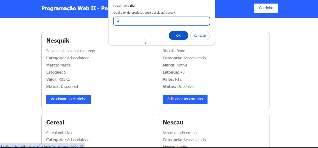

# Aplicação de cadastro de e-commerce
## 🖥️ Capa do projeto


## 📌 Sobre o projeto 
Este projeto é uma aplicação web simples que permite o gerenciamento de um carrinho de compras, cadastro de categorias, marcas e produtos. Foi desenvolvido utilizando HTML, CSS, JavaScript e PHP com MySQL para a manipulação de dados.

## 📝Estrutura do Projeto
A estrutura do projeto é a seguinte:   

### **Arquivos HTML**  

**index.php**: Página inicial que pode servir como a entrada para outras funcionalidades.  

**carrinho.php**: Página que exibe o carrinho de compras e produtos disponíveis. 

**categoria.php**: Página para cadastrar novas categorias.

**marca.php**: Página para cadastrar novas marcas.  

**produto.php**: Página para cadastrar novos produtos.  

**pedido.php**: Página para exibir o resumo do pedido.  
#
### **Arquivos CSS**

**css/style.css**: Arquivo de estilo que define a aparência das páginas.
Arquivos JavaScript

**js/jquery-2.1.4.min.js**: Biblioteca jQuery para facilitar a manipulação do DOM.

**js/script.js**: Script personalizado para adicionar interatividade às páginas.  
#
### **Scripts PHP**

**controller/conexao.php**: Script para estabelecer conexão com o banco de dados.  

**controller/carrinho-busca.php**: Script para buscar informações do carrinho.  

**controller/produtos-busca.php**: Script para buscar informações dos produtos.  

**controller/produtos-resumo.php**: Script para exibir o resumo do pedido.  

**insere-categoria.php**: Script para inserir uma nova categoria no banco de dados.  

**insere-marca.php**: Script para inserir uma nova marca no banco de dados.  

**insere-produto.php**: Script para inserir um novo produto no banco de dados.


# 🤖 Pré-requisitos
Antes de começar, certifique-se de ter o seguinte instalado:  
1. PHP 8.0.30
2. MariaDB 10.4.32
3. XAMPP 3.3.0

# Configuração do Banco de Dados
1. Crie um banco de dados MySQL e importe o esquema apropriado para criar as tabelas necessárias (categoria, marca, produtos, etc.).  

2. Atualize o arquivo controller/conexao.php com suas credenciais de banco de dados.
Como Executar
Clone o repositório para seu ambiente local.  

3. Coloque os arquivos na pasta do seu servidor local (por exemplo, na pasta htdocs se estiver usando XAMPP).  

4. Acesse a aplicação através do seu navegador, apontando para http://localhost/index.php.  

# Funcionalidades
Cadastro de Categorias: Permite adicionar novas categorias ao banco de dados.  

Cadastro de Marcas: Permite adicionar novas marcas ao banco de dados.  

Cadastro de Produtos: Permite adicionar novos produtos, associando-os a categorias e marcas existentes.  

Carrinho de Compras: Permite visualizar e adicionar produtos ao carrinho.  

Resumo do Pedido: Exibe um resumo do pedido feito.  


# Exemplos de Uso dos Métodos PHP  
## Cadastro de Categoria
**Arquivo:** *insere-categoria.php*

**Descrição:** Este script insere uma nova categoria no banco de dados.

**Exemplo de uso:**
Suponha que você queira adicionar uma nova categoria chamada "Eletrônicos". Você enviaria um formulário com o seguinte campo:
```markdown
<form action="insere-categoria.php" method="post">
    <label for="descricao">Descrição</label>
    <input type="text" name="descricao" value="Eletrônicos">
    <input type="submit" value="Cadastrar">
</form>
```  
Código PHP:
```markdown
<?php
include('controller/conexao.php');

$descricao = $_POST['descricao'];

// Inserindo a nova categoria no banco de dados
$cad_categoria = "INSERT INTO categoria(DESCRICAO) VALUES ('$descricao')";

if (mysqli_query($mysqli, $cad_categoria)) {
    echo "<h1>Nova categoria cadastrada com sucesso</h1>";
} else {
    echo "Erro: " . $cad_categoria . "<br>" . mysqli_error($mysqli);
}
mysqli_close($mysqli);
?>
```
# Cadastro de Marca
**Arquivo:** *insere-marca.php*

**Descrição:** Este script insere uma nova marca no banco de dados.

**Exemplo de uso:**
Suponha que você queira adicionar uma nova marca chamada "Samsung". Você enviaria um formulário com o seguinte campo:
```markdown

<form action="insere-marca.php" method="post">
    <label for="descricao">Descrição</label>
    <input type="text" name="descricao" value="Samsung">
    <input type="submit" value="Cadastrar">
</form>
``` 
Código PHP:

```markdown

<?php
include('controller/conexao.php');

$descricao = $_POST['descricao'];

// Inserindo a nova marca no banco de dados
$cad_marca = "INSERT INTO marca(DESCRICAO) VALUES ('$descricao')";

if (mysqli_query($mysqli, $cad_marca)) {
    echo "<h1>Nova marca cadastrada com sucesso</h1>";
} else {
    echo "Erro: " . $cad_marca . "<br>" . mysqli_error($mysqli);
}
mysqli_close($mysqli);
?>
 ``` 

# Cadastro de Produto
**Arquivo:** *insere-produto.php*

**Descrição:** Este script insere um novo produto no banco de dados, associando-o a uma categoria e uma marca.

**Exemplo de uso:**
Suponha que você queira adicionar um novo produto chamado "Smartphone Galaxy S21" com a categoria "Eletrônicos" e a marca "Samsung". Você enviaria um formulário com os seguintes campos:
```markdown
<form action="insere-produto.php" method="post">
    Nome: <input type="text" name="nome" value="Smartphone Galaxy S21"><br>
    Descrição: <input type="text" name="descricao" value="Smartphone de última geração"><br>
    Estoque: <input type="number" name="estoque" value="100"><br>
    Preço: <input type="number" name="preco" min="0.00" max="100000.00" step="0.01" value="2999.99"><br>
    Categoria:
    <select name="categoria">
        <option value="1">Eletrônicos</option>
    </select><br>
    Marca:
    <select name="marca">
        <option value="1">Samsung</option>
    </select>
    <br><br>
    <input type="submit" value="Cadastrar">
</form>
 ```
 Código PHP:
```markdown
<?php
include_once('controller/conexao.php');

$categotia = $_POST['categoria'];
$marca = $_POST['marca'];
$nome_produto = $_POST['nome'];
$descricao = $_POST['descricao'];
$estoque = $_POST['estoque'];
$preco = $_POST['preco'];

$grava_produto = "INSERT INTO produtos(IDCATEGORIA, IDMARCA, NOME, DESCRICAO, ESTOQUE, PRECO) VALUES ('$categotia', '$marca', '$nome_produto', '$descricao', '$estoque', '$preco')";

if (mysqli_query($mysqli, $grava_produto)) {
    echo "<script>alert('Produto cadastrado com sucesso'); window.location.href='produtos.php';</script>";
} else {
    echo "<script>alert('Produto não cadastrado'); window.location.href='produtos.php';</script>";
}
mysqli_close($mysqli);
?>
 ```
 # Referências

- [Documentação oficial do PHP: `mysqli_query()`](https://www.php.net/manual/pt_BR/mysqli.query.php)
- [Documentação oficial do PHP: `mysqli_affected_rows()`](https://www.php.net/manual/pt_BR/mysqli.affected-rows.php)
- [Documentação oficial do PHP: `mysqli_fetch_assoc()`](https://www.php.net/manual/pt_BR/mysqli-result.fetch-assoc.php)
- [Chatgpt:`Chatgpt.com`](https://chatgpt.com/)
